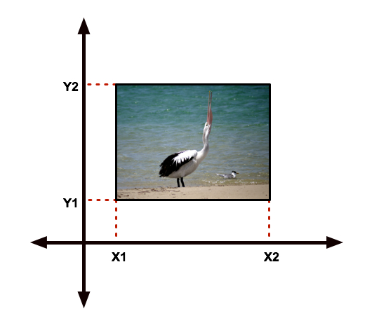
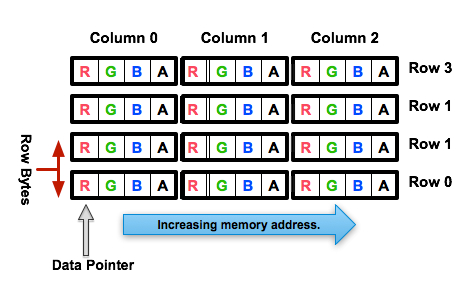

.. SPDX-License-Identifier: CC-BY-4.0
.. _invertExample:

This guide will take you through the fundamentals of processing images
in OFX. An example plugin will be used to illustrate how it all works
and its source can be found in the C++ file
`invert.cpp <https://github.com/ofxa/openfx/blob/master/Guide/Code/Example2/invert.cpp>`_.
This plugin takes an image and
inverts it (or rather calculates the complement of each component).
Ideally you should have read the guide to the :ref:`basic machinery of an OFX
plugin <basicExample>` before you read this guide.

Action Stations!
================

The invert example is pretty much the most minimal OFX plugin you can
write that processes images. It leaves many things at their default
settings which means it doesn’t have to trap more than four actions in
total  [1]_ and set very few switches.

From the source, here is the main entry routine that traps those
actions...

`invert.cpp <https://github.com/AcademySoftwareFoundation/openfx/blob/doc/Documentation/sources/Guide/Code/Example2/invert.cpp#L416>`__

.. code:: c++

      ////////////////////////////////////////////////////////////////////////////////
      // The main entry point function, the host calls this to get the plugin to do things.
      OfxStatus MainEntryPoint(const char *action,
                               const void *handle,
                               OfxPropertySetHandle inArgs,
                               OfxPropertySetHandle outArgs)
      {
        // cast to appropriate type
        OfxImageEffectHandle effect = (OfxImageEffectHandle) handle;

        OfxStatus returnStatus = kOfxStatReplyDefault;

        if(strcmp(action, kOfxActionLoad) == 0) {
          // The very first action called on a plugin.
          returnStatus = LoadAction();
        }
        else if(strcmp(action, kOfxActionDescribe) == 0) {
          // the first action called to describe what the plugin does
          returnStatus = DescribeAction(effect);
        }
        else if(strcmp(action, kOfxImageEffectActionDescribeInContext) == 0) {
          // the second action called to describe what the plugin does
          returnStatus = DescribeInContextAction(effect, inArgs);
        }
        else if(strcmp(action, kOfxImageEffectActionRender) == 0) {
          // action called to render a frame
          returnStatus = RenderAction(effect, inArgs, outArgs);
        }

        /// other actions to take the default value
        return returnStatus;
      }

    } // end of anonymous namespace

It leaves out some of the actions we had in the last example, which were
there for only illustrative purposes only. However, it is now trapping
one more, the :c:macro:`kOfxImageEffectActionRender` action. Funnily
enough, that is the action called to render a frame of output.

Describing Our Plugin
=====================

We have the standard two step description process for this plugin.

`invert.cpp <https://github.com/AcademySoftwareFoundation/openfx/blob/doc/Documentation/sources/Guide/Code/Example2/invert.cpp#L117>`__

.. code:: c++

      ////////////////////////////////////////////////////////////////////////////////
      // the plugin's basic description routine
      OfxStatus DescribeAction(OfxImageEffectHandle descriptor)
      {
        // set some labels and the group it belongs to
        gPropertySuite->propSetString(effectProps,
                                      kOfxPropLabel,
                                      0,
                                      "OFX Invert Example");
        gPropertySuite->propSetString(effectProps,
                                      kOfxImageEffectPluginPropGrouping,
                                      0,
                                      "OFX Example");

        // define the image effects contexts we can be used in, in this case a simple filter
        gPropertySuite->propSetString(effectProps,
                                      kOfxImageEffectPropSupportedContexts,
                                      0,
                                      kOfxImageEffectContextFilter);

        // set the bit depths the plugin can handle
        gPropertySuite->propSetString(effectProps,
                                      kOfxImageEffectPropSupportedPixelDepths,
                                      0,
                                      kOfxBitDepthFloat);
        gPropertySuite->propSetString(effectProps,
                                      kOfxImageEffectPropSupportedPixelDepths,
                                      1,
                                      kOfxBitDepthShort);
        gPropertySuite->propSetString(effectProps,
                                      kOfxImageEffectPropSupportedPixelDepths,
                                      2,
                                      kOfxBitDepthByte);

        // get the property set handle for the plugin
        OfxPropertySetHandle effectProps;
        gImageEffectSuite->getPropertySet(descriptor, &effectProps);

        // say that a single instance of this plugin can be rendered in multiple threads
        gPropertySuite->propSetString(effectProps,
                                      kOfxImageEffectPluginRenderThreadSafety,
                                      0,
                                      kOfxImageEffectRenderFullySafe);

        // say that the host should manage SMP threading over a single frame
        gPropertySuite->propSetInt(effectProps,
                                   kOfxImageEffectPluginPropHostFrameThreading,
                                   0,
                                   1);

        return kOfxStatOK;
      }

The function called for the describe action sets all the properties on
an effect that are independent of specific contexts. In this case it
sets some labels and says what contexts it can be used in, which is only
the **filter** context, where an effect has a single input and output.
It also says what data types it can support when processing images. This
is a property that belongs to the plugin as a whole, not to individual
clips (see below). If a plugin doesn’t support a data type needed by the
host, the host is at liberty to ignore it and get on with it’s life.

We said our plugin supports all the three standard pixel data types,
which various properties throughout the API use. The values are:

* :c:macro:`kOfxBitDepthByte`  Each component will be an 8 bit unsigned integer with a maximum value of 255.

* :c:macro:`kOfxBitDepthShort`  Each component will be an 16 bit unsigned integer with a maximum value of 65535.

* :c:macro:`kOfxBitDepthFloat`  Each component will be a 32 bit floating point number with a nominal white point of 1.

.. note::

    The :cpp:type:`OfxImageEffectHandle` passed to the describe calls should not
    be cached away, It only represents some object used while describing
    the effect. It is *not* the effect itself and when instances are
    created the handle will refer to a different object entirely. In
    general, never hang onto any effect handles in any global state.

Finally our plugin is setting some flags to do with multithreaded
rendering. The first flag, :c:macro:`kOfxImageEffectPluginRenderThreadSafety`
is used to indicate how plugins and instances should be used when
rendering in multiple threads. We are setting it to
:c:macro:`kOfxImageEffectRenderFullySafe`, which means that the host can have
any number of instances rendering and each instance could have possibly
have simultaneous renders called on it. (eg: at separate frames). The
other options are listed in the programming reference.

The second call sets the
:c:macro:`kOfxImageEffectPluginPropHostFrameThreading`, which says that the
host should manage any symmetric multiprocessing when rendering the
effect. Typically done by calling render on different tiles of the
output image. If not set, it is up to the plugin to launch the
appropriate number of threads and divide the processing appropriately
across them.

`invert.cpp <https://github.com/AcademySoftwareFoundation/openfx/blob/doc/Documentation/sources/Guide/Code/Example2/invert.cpp#L171>`__

.. code:: c++

      ////////////////////////////////////////////////////////////////////////////////
      //  describe the plugin in context
      OfxStatus
      DescribeInContextAction(OfxImageEffectHandle descriptor,
                              OfxPropertySetHandle inArgs)
      {
        OfxPropertySetHandle props;
        // define the mandated single output clip
        gImageEffectSuite->clipDefine(descriptor, "Output", &props);

        // set the component types we can handle on out output
        gPropertySuite->propSetString(props,
                                      kOfxImageEffectPropSupportedComponents,
                                      0,
                                      kOfxImageComponentRGBA);
        gPropertySuite->propSetString(props,
                                      kOfxImageEffectPropSupportedComponents,
                                      1,
                                      kOfxImageComponentAlpha);
        gPropertySuite->propSetString(props,
                                      kOfxImageEffectPropSupportedComponents,
                                      2,
                                      kOfxImageComponentRGB);

        // define the mandated single source clip
        gImageEffectSuite->clipDefine(descriptor, "Source", &props);

        // set the component types we can handle on our main input
        gPropertySuite->propSetString(props,
                                      kOfxImageEffectPropSupportedComponents,
                                      0,
                                      kOfxImageComponentRGBA);
        gPropertySuite->propSetString(props,
                                      kOfxImageEffectPropSupportedComponents,
                                      1,
                                      kOfxImageComponentAlpha);
        gPropertySuite->propSetString(props,
                                      kOfxImageEffectPropSupportedComponents,
                                      2,
                                      kOfxImageComponentRGB);

        return kOfxStatOK;
      }

Here we are describing the plugin when it is being used as a filter. In
this case we are describing two clips, the mandated *Source* and
*Output* clips. Each clip has a variety of properties on them, in this
case we are only setting what pixel components we accept on those
inputs. The components supported (unlike the data type) is a per clip
thinumgy. Pixels in OFX can currently only be of three types, which are
listed below.

:c:macro:`kOfxImageComponentRGBA` Each pixel has four samples, corresponding to Red, Green, Blue and Alpha. Packed as RGBA

:c:macro:`kOfxImageComponentRGB` Each pixel has three samples, corresponding to Red, Green and Blue. Packed as RGB.

:c:macro:`kOfxImageComponentAlpha` Each pixel has one sample, generally interpreted as an Alpha value.

.. note::

    The OpenGL rendering extension has significantly different set of
    capabilities for this.

.. _clips:

Clips
=====

I hear you ask "What are these clips of which you speak Mr Nicoletti?",
well they are a sequence of images that vary over time. They are
represented in the API by an :cpp:type:`OfxImageClipHandle` and have a name
plus an associated property set.

Depending on the context, you will have to describe some mandated number
of clips with specific names. For example the filter effect has two and
only two clips you must describe *Source* and *Output*, a **transition**
effect has three and only three clips *SourceFrom*, *SourceTo* and
*Output* while a **general** effect has to have one clip called *Output*
but as many other input clips as we want. There are ``**#defines**`` for
these in the various OFX header files. The Programming Reference has
more information on other contexts, and we will use more in later
examples.

There are many properties on a clip, and during description you get to
set a whole raft of them as to how you want them to behave. We are
relying on the defaults in this example that allow us to avoid issues
like field rendering and more.

You fetch images out of clips with a function call in the image effect
suite, where you ask for an image at a specific frame. In all cases the
clip named "Output" is the one that will give you the images you will be
writing to, the other clips are always sources and you should not modify
the data in them.

.. _images:

Images In OFX
=============

Before I start talking over the rendering in the example plugin, I
should tell you about images in OFX.

Images and the Image Plane
--------------------------

Images are contiguous rectangular regions of a nominally infinite 2D
image plane for which the host has data samples, in the form of
`pixels <http://alvyray.com/Memos/CG/Microsoft/6_pixel.pdf>`_.

The figure above shows our image spanning the plane from coordinates X1
to X2 in the X dimension and Y1 to Y2 in the Y dimension. We call these
four numbers the image’s **bounds**, and is the region an image is
guaranteed to have addressable data for.

.. note::

    Y goes **up** in OFX land, not down as is common in desktop
    publishing.

.. note::

    That the image bound is open on the right, so iteration is
    ``for (int x = x1; x < x2; ++x)``. This means the number of pixels
    in the X dimension is given by X2-X1, similarly for the Y dimension.

Image Data
----------

Images are made up of chunk of memory which is interpreted to be a 2D
array of pixels. Each pixel in an image has exactly the same number of
**components**, each component being of exactly the same **data type**.
OFX currently has pixels with one (A), three (RGB) or four components
(RGBA), which can be bytes, shorts, or a 32 bit floats.

The figure above shows a small (3x4) image containing RGBA pixels. OFX
returns a ``void *`` data pointer to the first component of the bottom
left pixel in the image, which will be at (X1, Y1) on the image plane.
Memory addresses increase left to right across the row of an OFX image,
with all components and pixels hard packed and contiguous within that
row.

Rows may or may not be contiguous in memory, so in our example the
address of component **R** at row 1 column 0, may or may not come
directly after component **A** at (2, 0). To manage this we use "row
bytes", which are the byte offset between rows, (**not** pixel or
component offsets). By breaking this offset out, hosts can more easily
map their pixel data into OFX images without having to copy. For example
a host that natively runs with Y down and packs images with the top row
first in memory would use negative row bytes and have the data pointer
point to it’s last row (which is the bottom row).

Pixel Address Calculation
-------------------------

So, given a coordinate on the image plane how do you calculate the
address of a pixel in the image? Well you use the following information:

-  a ``void*`` pointer to the bottom left corner of the image

-  four integers that define the **bounds** of the image for which there
   is data

-  the data type of each component

-  the type of each pixel (which yields the number of components per
   pixel)

-  the number of bytes that is the offset between rows

The code snippet below shows you how to use all that to find the address
of a pixel whose coordinates are on the image plane.

`invert.cpp <https://github.com/AcademySoftwareFoundation/openfx/blob/doc/Documentation/sources/Guide/Code/Example2/invert.cpp#L216>`__

.. code:: c++

      // Look up a pixel in the image. returns null if the pixel was not
      // in the bounds of the image
      template <class T>
      static inline T * pixelAddress(int x, int y,
                                     void *baseAddress,
                                     OfxRectI bounds,
                                     int rowBytes,
                                     int nCompsPerPixel)
      {
        // Inside the bounds of this image?
        if(x < bounds.x1 || x >= bounds.x2 || y < bounds.y1 || y >= bounds.y2)
          return NULL;

        // turn image plane coordinates into offsets from the bottom left
        int yOffset = y - bounds.y1;
        int xOffset = x - bounds.x1;

        // Find the start of our row, using byte arithmetic
        void *rowStartAsVoid = reinterpret_cast<char *>(baseAddress) + yOffset * rowBytes;

        // turn the row start into a pointer to our data type
        T *rowStart = reinterpret_cast<T *>(rowStartAsVoid);

        // finally find the position of the first component of column
        return rowStart + (xOffset * nCompsPerPixel);
      }

You will notice it is a templated function, where **T** will be
instantiated with the appropriate component type by other code.
**T** will be one of ``unsigned char``, ``unsigned short``
or ``float``.

In order the function…

-  checks if the pixel coordinate is within the bounds of the image. If
   it is not then we have no addressable pixel data at the point, so the
   function gives up and return NULL as an indication of that,

-  as we have ``x`` and ``y`` as coordinates on the *image
   plane*, it then turn the coordinates into offsets from the bottom
   left of the image with a simple subtraction,

-  it then finds the start of the row we are interested in by scaling
   our local y offset by ``rowBytes`` to figure the offset from our
   base address data pointer, *in bytes*. It adds that to the base
   address and now has the start of our row.

-  it turns the raw address at the start of the row into a pointer of
   our data type,

-  finally it offsets to the correct column by skippying over *xLocal*
   number of pixels, each of each which contain ``nComponents``.

Images Are Property Sets
------------------------

Images are property sets, you access all the data needed via the
standard OFX property mechanism. This has allowed us to expand the
information in an image and be 100% backwards compatible to existing
hosts and plugins.

Anyway, here is code from our example using the property mechanism to
get the required data from an image…

`invert.cpp <https://github.com/AcademySoftwareFoundation/openfx/blob/doc/Documentation/sources/Guide/Code/Example2/invert.cpp#L242>`__

.. code:: c++

     template <class T, int MAX>
      void PixelProcessing(OfxImageEffectHandle instance,
                           OfxPropertySetHandle sourceImg,
                           OfxPropertySetHandle outputImg,
                           OfxRectI renderWindow,
                           int nComps)
      {
    ...
        // fetch output image info from the property handle
        int dstRowBytes;
        OfxRectI dstBounds;
        void *dstPtr = NULL;
        gPropertySuite->propGetInt(outputImg, kOfxImagePropRowBytes, 0, &dstRowBytes);
        gPropertySuite->propGetIntN(outputImg, kOfxImagePropBounds, 4, &dstBounds.x1);
        gPropertySuite->propGetPointer(outputImg, kOfxImagePropData, 0, &dstPtr);

    ...
      }

      OfxStatus RenderAction( OfxImageEffectHandle instance,
                              OfxPropertySetHandle inArgs,
                              OfxPropertySetHandle outArgs)
      {
    ...
          // figure out the component type
          char *cstr;
          gPropertySuite->propGetString(outputImg, kOfxImageEffectPropComponents, 0, &cstr);
          std::string components = cstr;

    ...
          // figure out the data types
          gPropertySuite->propGetString(outputImg, kOfxImageEffectPropPixelDepth, 0, &cstr);
          std::string dataType = cstr;
    ...
    }

There are many more properties in an image, but we won’t need them for
this simple example and they’ll be covered in other tutorials.

.. _the_render_action:

The Render Action
=================

As stated above, the render action is the one used to get a plugin to
actually process images. I’ll go through it in stages rather than have
one big listing.

`invert.cpp <https://github.com/AcademySoftwareFoundation/openfx/blob/doc/Documentation/sources/Guide/Code/Example2/invert.cpp#L310>`__

.. code:: c++

      ////////////////////////////////////////////////////////////////////////////////
      // Render an output image
      OfxStatus RenderAction( OfxImageEffectHandle instance,
                              OfxPropertySetHandle inArgs,
                              OfxPropertySetHandle outArgs)
      {
        // get the render window and the time from the inArgs
        OfxTime time;
        OfxRectI renderWindow;
        OfxStatus status = kOfxStatOK;

        gPropertySuite->propGetDouble(inArgs, kOfxPropTime, 0, &time);
        gPropertySuite->propGetIntN(inArgs, kOfxImageEffectPropRenderWindow, 4, &renderWindow.x1);

This first listing shows how the **inArgs** are being used to say what
exactly to render. The property :c:macro:`kOfxPropTime` on **inArgs** is
the frame of the output clip to render. The property
:c:macro:`kOfxImageEffectPropRenderWindow` is the region that should be
written to.

The output image (which will be fetched later on) will have a **bounds**
that are at least as big as the render window. The bounds of the output
image could in fact be larger. This could happen if a host is
simultaneously calling the render action in separate threads to perform
symmetric multi-processing, each thread would be given a different
render window to fill in of the larger output image.

.. note::

    A plugin can have multiple actions being simultaneously in separate
    threads, especially the render action. Do not rely on any local
    state if you can help it. You can control how threading works in the
    describe actions.

.. note::

    To allow a plugin to be called in an SMP manner, or have multiple
    instances simultaneously rendering, the API has been designed so
    that the plugin does not rely on any implicit state, such as time,
    everything is explicit.

`invert.cpp <https://github.com/AcademySoftwareFoundation/openfx/blob/doc/Documentation/sources/Guide/Code/Example2/invert.cpp#L323>`__

.. code:: c++

        // fetch output clip
        OfxImageClipHandle outputClip;
        gImageEffectSuite->clipGetHandle(instance, "Output", &outputClip, NULL);

        // fetch main input clip
        OfxImageClipHandle sourceClip;
        gImageEffectSuite->clipGetHandle(instance, "Source", &sourceClip, NULL);

This next snippet fetches two clip handles by name from the instance,
using the image effect suite.  [2]_

`invert.cpp <https://github.com/AcademySoftwareFoundation/openfx/blob/doc/Documentation/sources/Guide/Code/Example2/invert.cpp#L331>`__

.. code:: c++

        // the property sets holding our images
        OfxPropertySetHandle outputImg = NULL, sourceImg = NULL;
        try {
          // fetch image to render into from that clip
          OfxPropertySetHandle outputImg;
          if(gImageEffectSuite->clipGetImage(outputClip, time, NULL, &outputImg) != kOfxStatOK) {
            throw " no output image!";
          }

          // fetch image at render time from that clip
          if (gImageEffectSuite->clipGetImage(sourceClip, time, NULL, &sourceImg) != kOfxStatOK) {
            throw " no source image!";
          }

We now (inside a try/catch block) fetch two images from the clips, again
using the image effect suite. Note we are asking for images at the frame
we were told to render. Effects that need images from other frames can
pass in different values to :cpp:func:`OfxImageEffectSuiteV1::clipGetImage`, but will need to trap
more actions than we have to make that all work correctly.

We will be given back two property set handles which represent our
images. If the call failed (which could be for a variety of good
reasons) we give up with a ``throw``.

`invert.cpp <https://github.com/AcademySoftwareFoundation/openfx/blob/doc/Documentation/sources/Guide/Code/Example2/invert.cpp#L345>`__

.. code:: c++

          // figure out the data types
          char *cstr;
          gPropertySuite->propGetString(outputImg, kOfxImageEffectPropComponents, 0, &cstr);
          std::string components = cstr;

          // how many components per pixel?
          int nComps = 0;
          if(components == kOfxImageComponentRGBA) {
            nComps = 4;
          }
          else if(components == kOfxImageComponentRGB) {
            nComps = 3;
          }
          else if(components == kOfxImageComponentAlpha) {
            nComps = 1;
          }
          else {
            throw " bad pixel type!";
          }

Now we want to know what’s inside our image’s pixels, so we can
correctly process it. We ask what components are present in the output
image. Because we have left certain settings at the default, the source
and output images will always have the same number of components and the
same data types. Which is why we aren’t checking for the source for its
pixel information.

`invert.cpp <https://github.com/AcademySoftwareFoundation/openfx/blob/doc/Documentation/sources/Guide/Code/Example2/invert.cpp#L365>`__

.. code:: c++

          // now do our render depending on the data type
          gPropertySuite->propGetString(outputImg, kOfxImageEffectPropPixelDepth, 0, &cstr);
          std::string dataType = cstr;

          if(dataType == kOfxBitDepthByte) {
            PixelProcessing<unsigned char, 255>(instance, sourceImg, outputImg, renderWindow, nComps);
          }
          else if(dataType == kOfxBitDepthShort) {
            PixelProcessing<unsigned short, 65535>(instance, sourceImg, outputImg, renderWindow, nComps);
          }
          else if (dataType == kOfxBitDepthFloat) {
            PixelProcessing<float, 1>(instance, sourceImg, outputImg, renderWindow, nComps);
          }
          else {
            throw " bad data type!";
            throw 1;
          }

Now we are enquiring as to what C type the components our image will be.
Again throwing if something has gone wrong. We use the data type to
correctly instantiate our templated function which will do the grunt
work of iterating over pixels. Note also that it is passing the nominal
maximum value of the data type as a template argument.

`invert.cpp <https://github.com/AcademySoftwareFoundation/openfx/blob/doc/Documentation/sources/Guide/Code/Example2/invert.cpp#L383>`__

.. code:: c++

        }
        catch(const char *errStr ) {
          bool isAborting = gImageEffectSuite->abort(instance);

          // if we were interrupted, the failed fetch is fine, just return kOfxStatOK
          // otherwise, something weird happened
          if(!isAborting) {
            status = kOfxStatFailed;
          }
          ERROR_IF(!isAborting, " Rendering failed because %s", errStr);

        }

        if(sourceImg)
          gImageEffectSuite->clipReleaseImage(sourceImg);
        if(outputImg)
          gImageEffectSuite->clipReleaseImage(outputImg);

        // all was well
        return status;
      }

This last bit is basically clean up. We have the ``catch`` for our
try/catch block. The first thing it does is ask the host application is
the effect being told to stop by calling the :cpp:func:`OfxImageEffectSuiteV1::abort` function on
the effect suite. We might have ended up in the catch block because the
an image could not be fetched, if that was a side effect of the host
interrupting processing, it is *not* counted as an error. So we check
that before we return a failed error state from our action.

Finally we release the images we have fetched and return the error
status.

.. note::

    Images should not be held onto outside the scope of the action they
    were fetched in, the data will not be guaranteed to be valid. It is
    polite to release them as soon as possible, especially if you are
    fetching multiple images on input.

Now for our pixel pushing code. [3]_

`invert.cpp <https://github.com/AcademySoftwareFoundation/openfx/blob/doc/Documentation/sources/Guide/Code/Example2/invert.cpp#L242>`__

.. code:: c++

      // iterate over our pixels and process them
      template <class T, int MAX>
      void PixelProcessing(OfxImageEffectHandle instance,
                           OfxPropertySetHandle sourceImg,
                           OfxPropertySetHandle outputImg,
                           OfxRectI renderWindow,
                           int nComps)
      {
        // fetch output image info from the property handle
        int dstRowBytes;
        OfxRectI dstBounds;
        void *dstPtr = NULL;
        gPropertySuite->propGetInt(outputImg, kOfxImagePropRowBytes, 0, &dstRowBytes);
        gPropertySuite->propGetIntN(outputImg, kOfxImagePropBounds, 4, &dstBounds.x1);
        gPropertySuite->propGetPointer(outputImg, kOfxImagePropData, 0, &dstPtr);

        if(dstPtr == NULL) {
          throw "Bad destination pointer";
        }

        // fetch input image info from the property handle
        int srcRowBytes;
        OfxRectI srcBounds;
        void *srcPtr = NULL;
        gPropertySuite->propGetInt(sourceImg, kOfxImagePropRowBytes, 0, &srcRowBytes);
        gPropertySuite->propGetIntN(sourceImg, kOfxImagePropBounds, 4, &srcBounds.x1);
        gPropertySuite->propGetPointer(sourceImg, kOfxImagePropData, 0, &srcPtr);

        if(srcPtr == NULL) {
          throw "Bad source pointer";
        }

We’ve shown bits of this before. Here we have a templated function that
we use to process our pixels. It is templated on the data type that the
components in each pixel will be, as well as a nominal *max* value to
use in our invert computation.

The first thing it does is to pull out the bounds, rowbytes and
destination pointer of our two images. We can now iterate over the
render window and set pixels in the output image.

`invert.cpp <https://github.com/AcademySoftwareFoundation/openfx/blob/doc/Documentation/sources/Guide/Code/Example2/invert.cpp#L273>`__

.. code:: c++

        // and do some inverting
        for(int y = renderWindow.y1; y < renderWindow.y2; y++) {
          if(y % 20 == 0 && gImageEffectSuite->abort(instance)) break;

          // get the row start for the output image
          T *dstPix = pixelAddress<T>(renderWindow.x1, y, dstPtr, dstBounds, dstRowBytes, nComps);

          for(int x = renderWindow.x1; x < renderWindow.x2; x++) {

            // get the source pixel
            T *srcPix = pixelAddress<T>(x, y, srcPtr, srcBounds, srcRowBytes, nComps);

            if(srcPix) {
              // we have one, iterate each component in the pixels
              for(int i = 0; i < nComps; ++i) {
                if(i != 3) { // We don't invert alpha.
                  *dstPix = MAX - *srcPix; // invert
                }
                else {
                  *dstPix = *srcPix;
                }
                ++dstPix; ++srcPix;
              }
            }
            else {
              // we don't have a pixel in the source image, set output to black
              for(int i = 0; i < nComps; ++i) {
                *dstPix = 0;
                ++dstPix;
              }
            }
          }
        }
      }

The first thing we do at each row we are processing is to check that the
host hasn’t told our plugin to abort processing. (Ideally you can do
this a bit less often than every line). We only to this every 20th row,
as the overhead on the host side to check for an abort might be quite
high.

The next thing we do is to use the ``pixelAddress`` function to find
the address of the first component of the first pixel in the current,
and we put it in ``dstPix``. Because we have a guarantee that the
bounds of the output image are at least as big as the render window, we
can simply increment ``dstPix`` across the row as we iterate over
the image.

Now we iterate across the row. We attempt to fetch the address of the
source pixel at our x,y location in the image plane. If we get it we
iterate over the number of component, setting the output to be the
invert  [4]_ of the input. If we don’t get it, we set the output pixel
to all zero.

.. note::

    You notice that we are continually calculating the address of
    ``srcPix`` at each pixel location and not incrementing the
    pointer as we could with ``dstPix``. The reason for this is
    that, at the default settings, there is no guarantee as to the
    bounds of the input image. It need not be congruent with any other
    input, the output or the render window.

I could obviously write this much more efficiently and avoid the
continual address calculation. However for illustrative purposes I
haven’t done that.

Summary
=======

This plugin has shown you the basics of working with OFX images, the
main things it illustrated were…

-  what are :ref:`clips <clips>` and how we get images from clips,

-  how :ref:`images <images>` are laid out in memory and how to
   access pixels,

-  the basics of the :ref:`render action <the_render_action>`

.. [1]
   I won’t bother going into the boot strapping boiler plate, if you are
   interested you can look at the source directly.

.. [2]
   The **NULL** at the end could have been the address of a property set
   handle if the effect needed to enquire about the clips properties.

.. [3]
   This is purely illustrative as to how the API works, it is in no way
   fast code, I would be ashamed to put code like this into a serious
   piece of image processing.

.. [4]
   complement really

