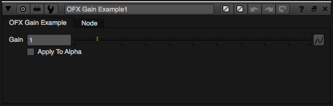

.. SPDX-License-Identifier: CC-BY-4.0
.. _gainExample:

This guide will take you through the basics of creating and using
parameters in OFX. An example plugin will be used to illustrate how it
all works and its source can be found in the C++ file
`gain.cpp <https://github.com/ofxa/openfx/blob/master/Guide/Code/Example3/gain.cpp>`_.
This plugin takes an image and
multiplies the pixel by the value held in a user visible parameter.
Ideally you should have read the guide to the :ref:`basic image
processing <invertExample>` before you read this guide.

.. _parameters:

Parameters
==========

Host applications need parameters to make their own effects work. Such
as the size of a blur effect, colours to apply to some text, a point for
the centre of a lens flare and so on. The host app will use some widget
set to present a user interface for the parameter, have ways to do
undo/redo, saving/loading, manage animation etc…

The OFX parameters suite is the bridge from a plugin to the host’s
native parameter set. So plugin devs don’t have to do all that work for
themselves and also get the other advantages a host’s parameters system
may give (e.g. scripting).

The way it works is fairly simple in concept, we get a plugin to tell
the host what parameters it wants during description. When an instance
is created, the host will make whatever native data structures it needs
to manage those params. The plugin can then grab values from the various
parameters to do what it needs to do during various actions, it can even
write back to parameters under certain conditions.

Our simple gain example will make two parameters, a parameter that is of
type ``double`` [1]_ which is the gain amount and a ``bool`` param
which controls whether to apply the gain amount to the Alpha of an RGBA
image. There are more parameter types, and quite a few properties you
can set on a param to control how it should behave in a host
application.
The current parameter types available are :ref:`listed here.<parameterTypes>`

.. note::

    A key concept in OFX is that the state of a plugin instance is
    totally and uniquely defined by the value of its parameters and
    input clips. You are asking for trouble if you try and store
    important data in separate files and so on. The host won’t be able
    to properly know when things have changed, how to manage that extra
    data and so on. Attempting to manage data outside of the parameter
    set will almost certainly cause hosts to lose track of the correct
    render and you will get angry users. This is a fundamental aspect of
    the API. If it isn’t in a parameter, it is going to cause problems
    with the host if you rely on it.

.. _actions:

Actions
=======

This example doesn’t trap any actions you haven’t already seen in the
other examples, it just does a little bit more in them. Seeing as you
should be familiar with how the main entry point works, I won’t bother
with the code listing from now on. The actions our plugin traps are now:

-  :c:macro:`kOfxActionLoad` - to grab suites from the host,

-  :c:macro:`kOfxActionDescribe` and :c:macro:`kOfxImageEffectActionDescribeInContext` - to
   describe the plugin to the host, *including parameters*,

-  :c:macro:`kOfxActionCreateInstance` and :c:macro:`kOfxActionDestroyInstance` - to create
   and destroy instance data, where we cache handles to clips and
   parameters,

-  :c:macro:`kOfxImageEffectActionIsIdentity` - to check if the parameter values
   are at their defaults and so the plugin can be ignore by the host,

-  :c:macro:`kOfxImageEffectActionRender` - to actually process pixels.

Now seeing as we are going to be playing with parameters, our plugin
will need a new suite, the parameters suite, and our load action now
looks like:

`gain.cpp <https://github.com/AcademySoftwareFoundation/openfx/blob/doc/Documentation/sources/Guide/Code/Example3/gain.cpp#L101>`__

.. code:: c++

      OfxPropertySuiteV1    *gPropertySuite    = 0;
      OfxImageEffectSuiteV1 *gImageEffectSuite = 0;
      OfxParameterSuiteV1   *gParameterSuite   = 0;

      ////////////////////////////////////////////////////////////////////////////////
      // get the named suite and put it in the given pointer, with error checking
      template <class SUITE>
      void FetchSuite(SUITE *& suite, const char *suiteName, int suiteVersion)
      {
        suite = (SUITE *) gHost->fetchSuite(gHost->host, suiteName, suiteVersion);
        if(!suite) {
          ERROR_ABORT_IF(suite == NULL,
                         "Failed to fetch %s version %d from the host.",
                         suiteName,
                         suiteVersion);
        }
      }

      ////////////////////////////////////////////////////////////////////////////////
      // The first _action_ called after the binary is loaded
      OfxStatus LoadAction(void)
      {
        // fetch our three suites
        FetchSuite(gPropertySuite,    kOfxPropertySuite,    1);
        FetchSuite(gImageEffectSuite, kOfxImageEffectSuite, 1);
        FetchSuite(gParameterSuite,   kOfxParameterSuite,   1);

        return kOfxStatOK;
      }

You can see I’ve written a ``FetchSuite`` function, as I got bored
of writing the same code over and over. We are now fetching the a suite
of type :cpp:class:`OfxParameterSuiteV1` which is defined in the header file
**ofxParam.h**.  [2]_.

.. _describing_our_plugin:

Describing Our Plugin
=====================

We have the standard two step description process for this plugin. The
Describe action is almost exactly the same as in our previous examples,
some names and labels have been changed is all, so I won’t list it.
However, the describe in context action has a few more things going on.

In the listings below I’ve chopped out the code to describe clips, as it
is exactly the same as in the last example. What’s new is the bit where
we describe parameters. I’ll show the describe in context action in
several small chunks to take you through it.

`gain.cpp <https://github.com/AcademySoftwareFoundation/openfx/blob/doc/Documentation/sources/Guide/Code/Example3/gain.cpp#L228>`__

.. code:: c++

      OfxStatus
      DescribeInContextAction(OfxImageEffectHandle descriptor,
                              OfxPropertySetHandle inArgs)
      {
        ...
        BIG SNIP OF EXACTLY THE SAME CODE IN THE LAST EXAMPLE
        ...

        // first get the handle to the parameter set
        OfxParamSetHandle paramSet;
        gImageEffectSuite->getParamSet(descriptor, &paramSet);

        // properties on our parameter
        OfxPropertySetHandle paramProps;

        // now define a 'gain' parameter and set its properties
        gParameterSuite->paramDefine(paramSet,
                                     kOfxParamTypeDouble,
                                     GAIN_PARAM_NAME,
                                     &paramProps);

The first thing we do is to grab a :c:type:`OfxParamSetHandle` from the
effect descriptor. This object represents all the parameters attached to
a plugin and is independent and orthogonal to an image effect.

The parameter suite is then used to define a parameter on that parameter
set. In this case its type is double, and its name is "gain". These are
the two most important things for a parameter.

.. note::

    The name uniquely identifies that parameter within the API, so no
    two parameters can have the same name.

The last argument to `paramDefine` is an optional pointer to the
new parameter’s property set handle. Each parameter has a set of
properties we use to refine its behaviour, most of which have sensible
defaults.

`gain.cpp <https://github.com/AcademySoftwareFoundation/openfx/blob/doc/Documentation/sources/Guide/Code/Example3/gain.cpp#L278>`__

.. code:: c++

        gPropertySuite->propSetString(paramProps,
                                      kOfxParamPropDoubleType,
                                      0,
                                      kOfxParamDoubleTypeScale);

The first property on our *gain* param we set is the kind of double
parameter it is. Many host applications have different kind of double
parameters and user interfaces that make working with them easier. For
example a parameter used to control a rotation might have a little dial
in the UI to spin the angle, a 2D position parameter might get cross
hairs over the image and so on. In this case we are saying that our
double parameter represents a scaling value. OFX has more kinds of
double parameter which you can use to best for your effect.

`gain.cpp <https://github.com/AcademySoftwareFoundation/openfx/blob/doc/Documentation/sources/Guide/Code/Example3/gain.cpp#L282>`__

.. code:: c++

        gPropertySuite->propSetDouble(paramProps,
                                      kOfxParamPropDefault,
                                      0,
                                      1.0);
        gPropertySuite->propSetDouble(paramProps,
                                      kOfxParamPropMin,
                                      0,
                                      0.0);

This section sets a default value for our parameter and a logical a
minimum value below which it cannot go. Note it does not set a maximum
value, so the parameter should not be clamped to any upper value ever.

`gain.cpp <https://github.com/AcademySoftwareFoundation/openfx/blob/doc/Documentation/sources/Guide/Code/Example3/gain.cpp#L290>`__

.. code:: c++

        gPropertySuite->propSetDouble(paramProps,
                                      kOfxParamPropDisplayMin,
                                      0,
                                      0.0);
        gPropertySuite->propSetDouble(paramProps,
                                      kOfxParamPropDisplayMax,
                                      0,
                                      10.0);

Numbers are often manipulated with sliders widgets in user interfaces,
and it is useful to set a range on those sliders. Which is exactly what
we are doing here. This is distinct to the logical minimum and maximum
values, so you can set a *useful* range for the UI, but still allow the
values to be outside that range. So here a slider would only allow
values between 0.0 and 10.0 for our gain param, but the parameter could
be set to a million via other means, eg: typing in a UI number box,
animation, scripting whatever.

`gain.cpp <https://github.com/AcademySoftwareFoundation/openfx/blob/doc/Documentation/sources/Guide/Code/Example3/gain.cpp#L298>`__

.. code:: c++

        gPropertySuite->propSetString(paramProps,
                                      kOfxPropLabel,
                                      0,
                                      "Gain");
        gPropertySuite->propSetString(paramProps,
                                      kOfxParamPropHint,
                                      0,
                                      "How much to multiply the image by.");

Here we are setting two text field on the param. The first is a label
for the parameter. This is to be used in any UI the host has to label
the parameter. It defaults to the name of the param, but it can be
entirely different. Finally we set a hint string to be used for the
parameter.

`gain.cpp <https://github.com/AcademySoftwareFoundation/openfx/blob/doc/Documentation/sources/Guide/Code/Example3/gain.cpp#L308>`__

.. code:: c++

        // and define the 'applyToAlpha' parameters and set its properties
        gParameterSuite->paramDefine(paramSet,
                                     kOfxParamTypeBoolean,
                                     APPLY_TO_ALPHA_PARAM_NAME,
                                     &paramProps);
        gPropertySuite->propSetInt(paramProps,
                                   kOfxParamPropDefault,
                                   0,
                                   0);
        gPropertySuite->propSetString(paramProps,
                                      kOfxParamPropHint,
                                      0,
                                      "Whether to apply the gain value to alpha as well.");
        gPropertySuite->propSetString(paramProps,
                                      kOfxPropLabel,
                                      0,
                                      "Apply To Alpha");

        return kOfxStatOK;
      }

In this last section we define a second parameter, named *applyToAlpha*,
which is of type boolean. We then set some obvious state on it and we
are done. Notice the label we set, it is much clearer to read than the
name.

And that’s it, we’ve defined two parameters for our plugin. There are
many more properties you can set on your plugin to control how they
behave and to give hints as to what you are going to do to them.

Finally, the image above shows the control panel for an instance of our
example inside Nuke.

.. _instances_and_parameters:

Instances and Parameters
========================

When the host creates an instance of the plugin, it will first create
all the native data structures it needs to represent the plugin, fully
populate them with the required values, and only then call the create
instance action.

So what happens in the create instance action then? Possibly nothing,
you can always grab parameters from an instance by name at any time. But
to make our code a bit cleaner and to show an example of instance data
being used, we are going to trap create instance.

`gain.cpp <https://github.com/AcademySoftwareFoundation/openfx/blob/doc/Documentation/sources/Guide/Code/Example3/gain.cpp#L111>`__

.. code:: c++

      ////////////////////////////////////////////////////////////////////////////////
      // our instance data, where we are caching away clip and param handles
      struct MyInstanceData {
        // handles to the clips we deal with
        OfxImageClipHandle sourceClip;
        OfxImageClipHandle outputClip;

        // handles to a our parameters
        OfxParamHandle gainParam;
        OfxParamHandle applyToAlphaParam;
      };

To stop duplicating code all over, and to minimise fetches to various
handles, we are going to cache away handles to our clips and parameters
in a simple struct. Note that these handles are valid for the duration
of the instance.

`gain.cpp <https://github.com/AcademySoftwareFoundation/openfx/blob/doc/Documentation/sources/Guide/Code/Example3/gain.cpp#L330>`__

.. code:: c++

      ////////////////////////////////////////////////////////////////////////////////
      /// instance construction
      OfxStatus CreateInstanceAction( OfxImageEffectHandle instance)
      {
        OfxPropertySetHandle effectProps;
        gImageEffectSuite->getPropertySet(instance, &effectProps);

        // To avoid continual lookup, put our handles into our instance
        // data, those handles are guaranteed to be valid for the duration
        // of the instance.
        MyInstanceData *myData = new MyInstanceData;

        // Set my private instance data
        gPropertySuite->propSetPointer(effectProps, kOfxPropInstanceData, 0, (void *) myData);

        // Cache the source and output clip handles
        gImageEffectSuite->clipGetHandle(instance, "Source", &myData->sourceClip, 0);
        gImageEffectSuite->clipGetHandle(instance, "Output", &myData->outputClip, 0);

        // Cache away the param handles
        OfxParamSetHandle paramSet;
        gImageEffectSuite->getParamSet(instance, &paramSet);
        gParameterSuite->paramGetHandle(paramSet,
                                        GAIN_PARAM_NAME,
                                        &myData->gainParam,
                                        0);
        gParameterSuite->paramGetHandle(paramSet,
                                        APPLY_TO_ALPHA_PARAM_NAME,
                                        &myData->applyToAlphaParam,
                                        0);

        return kOfxStatOK;
      }

So here is the function called when we trap a create instance action.
You can see that it allocates a MyInstanceData struct and caches it away
in the instance’s property set.

It then fetches handles to the two clips and two parameters by name and
caches those into the newly created struct.

`gain.cpp <https://github.com/AcademySoftwareFoundation/openfx/blob/doc/Documentation/sources/Guide/Code/Example3/gain.cpp#L123>`__

.. code:: c++

      ////////////////////////////////////////////////////////////////////////////////
      // get my instance data from a property set handle
      MyInstanceData *FetchInstanceData(OfxPropertySetHandle effectProps)
      {
        MyInstanceData *myData = 0;
        gPropertySuite->propGetPointer(effectProps,
                                       kOfxPropInstanceData,
                                       0,
                                       (void **) &myData);
        return myData;
      }

And here is a simple function to fetch instance data. It is actually
overloaded and there is another version that take an
:c:type:`OfxImageEffectHandle`.

Of course we now need to trap the destroy instance action to delete our
instance data, otherwise we will get memory leaks.

`gain.cpp <https://github.com/AcademySoftwareFoundation/openfx/blob/doc/Documentation/sources/Guide/Code/Example3/gain.cpp#L364>`__

.. code:: c++

      ////////////////////////////////////////////////////////////////////////////////
      // instance destruction
      OfxStatus DestroyInstanceAction( OfxImageEffectHandle instance)
      {
        // get my instance data
        MyInstanceData *myData = FetchInstanceData(instance);
        delete myData;

        return kOfxStatOK;
      }

.. _getting_values_from_instances:

Getting Values From Instances
=============================

So we’ve define our parameters, we’ve got handles to the instance of
them, but we will want to grab the value of the parameters to actually
use them at render time.

`gain.cpp <https://github.com/AcademySoftwareFoundation/openfx/blob/doc/Documentation/sources/Guide/Code/Example3/gain.cpp#L490>`__

.. code:: c++

      ////////////////////////////////////////////////////////////////////////////////
      // Render an output image
      OfxStatus RenderAction( OfxImageEffectHandle instance,
                              OfxPropertySetHandle inArgs,
                              OfxPropertySetHandle outArgs)
      {
        // get the render window and the time from the inArgs
        OfxTime time;
        OfxRectI renderWindow;
        OfxStatus status = kOfxStatOK;

        gPropertySuite->propGetDouble(inArgs, kOfxPropTime, 0, &time);
        gPropertySuite->propGetIntN(inArgs, kOfxImageEffectPropRenderWindow, 4, &renderWindow.x1);

        // get our instance data which has out clip and param handles
        MyInstanceData *myData = FetchInstanceData(instance);

        // get our param values
        double gain = 1.0;
        int applyToAlpha = 0;
        gParameterSuite->paramGetValueAtTime(myData->gainParam, time, &gain);
        gParameterSuite->paramGetValueAtTime(myData->applyToAlphaParam, time, &applyToAlpha);

    ....

We are using the :cpp:func:`OfxParameterSuiteV1::paramGetValueAtTime` suite function to get the
value of our parameters for the given time we are rendering at. Nearly
all actions passed to an instance will have a time to perform the
instance at, you should use this when fetching values out of a param.

The param get value functions use var-args to return values to plugins,
similar to a C scanf function.

And finally here is a snippet of the templated pixel pushing code where
we do the actual processing using our parameter values;

`gain.cpp <https://github.com/AcademySoftwareFoundation/openfx/blob/doc/Documentation/sources/Guide/Code/Example3/gain.cpp#L437>`__

.. code:: c++

        // and do some processing
        for(int y = renderWindow.y1; y < renderWindow.y2; y++) {
          if(y % 20 == 0 && gImageEffectSuite->abort(instance)) break;

          // get the row start for the output image
          T *dstPix = pixelAddress<T>(renderWindow.x1, y,
                                      dstPtr,
                                      dstBounds,
                                      dstRowBytes,
                                      nComps);

          for(int x = renderWindow.x1; x < renderWindow.x2; x++) {

            // get the source pixel
            T *srcPix = pixelAddress<T>(x, y,
                                        srcPtr,
                                        srcBounds,
                                        srcRowBytes,
                                        nComps);

            if(srcPix) {
              // we have one, iterate each component in the pixels
              for(int i = 0; i < nComps; ++i) {
                if(i != 3 || applyToAlpha) {
                  // multiply our source component by our gain value
                  double value = *srcPix * gain;

                  // if it has gone out of legal bounds, clamp it
                  if(MAX != 1) {  // we let floating point pixels over and underflow
                    value = value < 0 ? 0 : (value > MAX ? MAX : value);
                  }
                  *dstPix = T(value);
                }
                else {
                  *dstPix = *srcPix;
                }
                // increment to next component
                ++dstPix; ++srcPix;
              }
            }
            else {
              // we don't have a pixel in the source image, set output to zero
              for(int i = 0; i < nComps; ++i) {
                *dstPix = 0;
                ++dstPix;
              }
            }
          }
        }

Notice that we are checking to see if ``MAX != 1``, which means our
pixels are not floating point. If that is the case, we are clamping the
pixel’s value so we don’t get integer overflow.

.. _summary:

Summary
=======

This plugin has shown you the basics of working with OFX parameters, the
main things it illustrated were:

-  defining parameters in the define in context action,

-  setting properties to control the behaviour of parameters,

-  using the instance data pointer to cache away handles to instances of
   parameters and clips,

-  fetching values of a parameter from parameter instance handles and
   using them to process pixels.

.. [1]
   the API manages all floating point params as doubles, the host could
   be using 32 bit floats, or fixed precision for that matter, so long
   as the values are passed back and forth over the API as doubles, all
   will be fine

.. [2]
   The suite is completely independent of the image effect suite and
   could happily be used to describe parameters to other types of
   plugins

