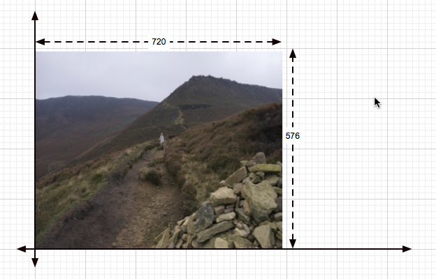
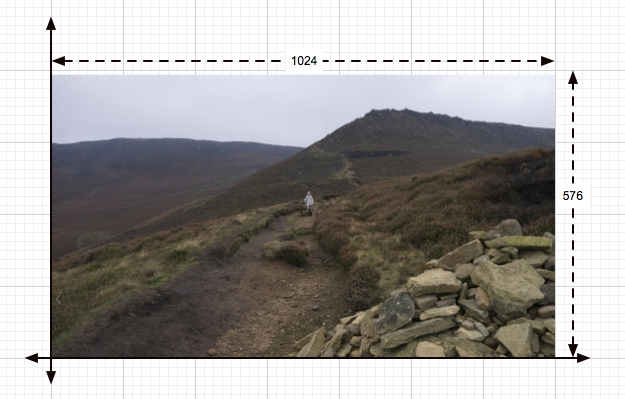
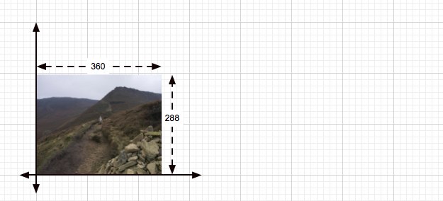

.. SPDX-License-Identifier: CC-BY-4.0
.. _circleExample:

This guide will introduce the spatial coordinate system used by OFX and
will illustrate that with a simple circle drawing plugin.
Its source can be found in the source code file
`circle.cpp <https://github.com/ofxa/openfx/blob/master/Guide/Code/Example5/circle.cpp>`_.
This plugin takes a clip and draws a circle over it. The colour, size and position
of the circle are controlled by several parameters.

.. _spatial_coordinate_systems:

Spatial Coordinate Systems
==========================

There are two main coordinate systems in OFX, these are the :ref:`pixel
coordinates<PixelCoordinates>` system and the :ref:`canonical coordinates<CanonicalCoordinates>` system. I’ll
describe them both, but first a slight digression.

.. _pixel_aspect_ratios:

Pixel Aspect Ratios
-------------------

Some display formats (for example standard definition PAL and NTSC) have
non square pixels, which is quite annoying in my opinion. The `pixel
aspect ratio <https://en.wikipedia.org/wiki/Pixel_aspect_ratio>`__
defines how non-square your pixel is.

For example, a digital PAL 16:9 wide-screen image has 720 by 576 actual
addressable pixels, however it has a pixel aspect ratio of ~1.42  [1]_.

This means on the display device, each of those pixels are stretched
horizontally by a factor of ~1.42. If it were square pixels, our
displayed image would actually have 1024 pixels.

Looking at the two images above you can distinctly see the affect that
the PAR has, the image appears *squashed* when viewed as raw pixels, but
these stretch out to look correct on our final display device.

.. _render_scales:

Render Scales
-------------

Applications typically let a user generate low resolution proxy previews
of their work, either to save time or space until they have finished. In
OFX we call this applying a **render scale**, which has two values one
for X and one for Y.

If we were doing a half resolution proxy render of our PAL 16:9 project,
we’d have a renderscale of (0.5,0.5), and 360 by 288 addressable pixels
in an image, with a PAR of 1.42.

.. _coordinate_systems:

Coordinate Systems
------------------

We call the coordinate system which allows us to index honest to
goodness pixels in memory, the :ref:`pixel
coordinates<PixelCoordinates>` system. It is
usually represented with integers. For example the **bounds** of our
image data are in pixel coordinates.

Now expressing positions or sizes on the image plane in pixel
coordinates is problematic, both because of pixel aspect ratios and
render scales. The problem with sizes is that a circle drawn with a
constant radius in pixel coordinates will not necessarily be circular on
the final display device, it will be stretched by the pixel aspect
ratio. Circles won’t be round.

A similar problem applies to render scales, when you say something is at
a position, it has to be independent of the renderscale.

To get around this, we have the :ref:`canonical coordinates<CanonicalCoordinates>` system. This is
on an idealised image plane, where all pixels are square and we have no
scales applied to any data. Canonical coordinates are typically
represented by doubles.

Back to our PAL 16:9 example. The canonical coordinate system for that
image would always has x==0 at the left and x==1023 at the right,
circles are always appear to be round and the arithmetic is easy. We use
the canonical coordinate system to express render scale and PAR
invariant data. This is the coordinate system we express spatial
parameters in.

There was a third coordinate system, the :ref:`Normalised Coordinates<NormalisedCoordinateSystem>` System,
but in practice this proved to be problematic and has been deprecated.

.. _mapping_between_coordinate_systems:

Mapping Between Coordinate Systems
----------------------------------

Obviously on render you will need to map parameters from :ref:`canonical coordinates<CanonicalCoordinates>`
to the required :ref:`pixel coordinates<PixelCoordinates>`, or vice versa. That is
fortunately very easy, you just need to do a bit of multiplying via the
pixel aspect ratio and the renderscale.
:ref:`See reference for more details.<MappingCoordinates>`

.. _loading_our_plugin:

Loading Our Plugin
==================

This plugin highlights the fact that the OFX API is really a way a
plugin and a host can have a discussion so they can both figure out how
they should operate. It allows plugins to modify their behaviour
depending on what the host says it can do.

Here is the source for the load action…

`circle.cpp <https://github.com/AcademySoftwareFoundation/openfx/blob/doc/Documentation/sources/Guide/Code/Example5/circle.cpp#L348>`__

.. code:: c++

      ////////////////////////////////////////////////////////////////////////////////
      // The first _action_ called after the binary is loaded (three boot strapper functions will be however)
      OfxStatus LoadAction(void)
      {
        // fetch our three suites
        FetchSuite(gPropertySuite,    kOfxPropertySuite,    1);
        FetchSuite(gImageEffectSuite, kOfxImageEffectSuite, 1);
        FetchSuite(gParameterSuite,   kOfxParameterSuite,   1);

        int verSize = 0;
        if(gPropertySuite->propGetDimension(gHost->host, kOfxPropAPIVersion, &verSize) == kOfxStatOK) {
          verSize = verSize > 2 ? 2 : verSize;
          gPropertySuite->propGetIntN(gHost->host,
                                      kOfxPropAPIVersion,
                                      2,
                                      gAPIVersion);
        }

        // we only support 1.2 and above
        if(gAPIVersion[0] == 1 && gAPIVersion[1] < 2) {
          return kOfxStatFailed;
        }

        /// does the host support multi-resolution images
        gPropertySuite->propGetInt(gHost->host,
                                   kOfxImageEffectPropSupportsMultiResolution,
                                   0,
                                   &gHostSupportsMultiRes);

        return kOfxStatOK;
      }

It fetches three suites then it checks to see if the
:c:macro:`kOfxPropAPIVersion` property exists on the host, if it does it then
checks that the version is at least "1.2", as we later rely on features
only available in that version of the API.

The next thing it does is to check that the host is supports multiple
resolutions. This is short hand for saying that the host allows input
and output clips to have different regions of definition, and images may
be passed to the plugin that have differing bounds. This is also a
property of the plugin descriptor, but we’ve left it at the default
value, which is *true*, as our plugin does support multiple resolutions.

We are checking for multiple resolution support to conditionally modify
our plugin’s behaviour in later actions.

.. _description:

Description
===========

Now, onto our plugin. The description action is pretty standard, as is
the describe in context action. I’ll just show you snippets of the
interesting bits.

Note, we are relying on a parameter type that is only available with the
1.2 version of OFX. Our plugin checks for this version of the API the
host supports and will fail gracefully during the load action.

`circle.cpp <https://github.com/AcademySoftwareFoundation/openfx/blob/doc/Documentation/sources/Guide/Code/Example5/circle.cpp#L471>`__

.. code:: c++

        // set the properties on the radius param
        gParameterSuite->paramDefine(paramSet,
                                     kOfxParamTypeDouble,
                                     RADIUS_PARAM_NAME,
                                     &radiusParamProps);

        gPropertySuite->propSetString(radiusParamProps,
                                      kOfxParamPropDoubleType,
                                      0,
                                      kOfxParamDoubleTypeX);

        gPropertySuite->propSetString(radiusParamProps,
                                      kOfxParamPropDefaultCoordinateSystem,
                                      0,
                                      kOfxParamCoordinatesNormalised);

        gPropertySuite->propSetDouble(radiusParamProps,
                                      kOfxParamPropDefault,
                                      0,
                                      0.25);
        gPropertySuite->propSetDouble(radiusParamProps,
                                      kOfxParamPropMin,
                                      0,
                                      0);
        gPropertySuite->propSetDouble(radiusParamProps,
                                      kOfxParamPropDisplayMin,
                                      0,
                                      0.0);
        gPropertySuite->propSetDouble(radiusParamProps,
                                      kOfxParamPropDisplayMax,
                                      0,
                                      2.0);
        gPropertySuite->propSetString(radiusParamProps,
                                      kOfxPropLabel,
                                      0,
                                      "Radius");
        gPropertySuite->propSetString(radiusParamProps,
                                      kOfxParamPropHint,
                                      0,
                                      "The radius of the circle.");

Here we are defining the parameter that controls the radius of our
circle we will draw. It’s a double param, and the type of double param
is :c:macro:`kOfxParamDoubleTypeX`,  [2]_ which says to the host, this
represents a size in X in canonical coordinates. The host can display
that however it like, but to the API, it needs to pass values back in
canonical coordinates.

The other thing we do is to set up the default value. Which is 0.25,
which seems to be a mighty small circle, as is the display maximum value
of 2.0. However, note the property
:c:macro:`kOfxParamPropDefaultCoordinateSystem` being set to
:c:macro:`kOfxParamCoordinatesNormalised`, this says that defaults/mins/maxes
are being described relative to the project size. So our circle’s radius
will default to be a quarter of the nominal project size’s x dimension.
For a 1080 HD project, this would be a value of 480.

`circle.cpp <https://github.com/AcademySoftwareFoundation/openfx/blob/doc/Documentation/sources/Guide/Code/Example5/circle.cpp#L513>`__

.. code:: c++

        // set the properties on the centre param
        OfxPropertySetHandle centreParamProps;
        static double centreDefault[] = {0.5, 0.5};

        gParameterSuite->paramDefine(paramSet,
                                     kOfxParamTypeDouble2D,
                                     CENTRE_PARAM_NAME,
                                     &centreParamProps);

        gPropertySuite->propSetString(centreParamProps,
                                      kOfxParamPropDoubleType,
                                      0,
                                      kOfxParamDoubleTypeXYAbsolute);
        gPropertySuite->propSetString(centreParamProps,
                                      kOfxParamPropDefaultCoordinateSystem,
                                      0,
                                      kOfxParamCoordinatesNormalised);
        gPropertySuite->propSetDoubleN(centreParamProps,
                                       kOfxParamPropDefault,
                                       2,
                                       centreDefault);
        gPropertySuite->propSetString(centreParamProps,
                                      kOfxPropLabel,
                                      0,
                                      "Centre");
        gPropertySuite->propSetString(centreParamProps,
                                      kOfxParamPropHint,
                                      0,
                                      "The centre of the circle.");

Here we are defining the parameter that controls the position of the
centre of our circle. It’s a 2D double parameter and we are telling the
host that it represents an absolute position in the canonical coordinate
system  [3]_. Some hosts will automatically add user interface handles
for such parameters to let you simply drag such positions around. We are
also setting the default values relative to the project size, and in
this case (0.5, 0.5), it should appear in the centre of the final image.

`circle.cpp <https://github.com/AcademySoftwareFoundation/openfx/blob/doc/Documentation/sources/Guide/Code/Example5/circle.cpp#L543>`__

.. code:: c++

        // set the properties on the colour param
        OfxPropertySetHandle colourParamProps;
        static double colourDefault[] = {1.0, 1.0, 1.0, 0.5};

        gParameterSuite->paramDefine(paramSet,
                                     kOfxParamTypeRGBA,
                                     COLOUR_PARAM_NAME,
                                     &colourParamProps);
        gPropertySuite->propSetDoubleN(colourParamProps,
                                       kOfxParamPropDefault,
                                       4,
                                       colourDefault);
        gPropertySuite->propSetString(colourParamProps,
                                      kOfxPropLabel,
                                      0,
                                      "Colour");
        gPropertySuite->propSetString(centreParamProps,
                                      kOfxParamPropHint,
                                      0,
                                      "The colour of the circle.");

This is obvious, we are defining an RGBA parameter to control the colour
and transparency of our circle. Colours are always normalised 0 to 1, so
when you get and set the colour, you need to scale the values up to the
nominal white point of your image, which is implicitly defined by the
data type of the image.

`circle.cpp <https://github.com/AcademySoftwareFoundation/openfx/blob/doc/Documentation/sources/Guide/Code/Example5/circle.cpp#L564>`__

.. code:: c++

        if(gHostSupportsMultiRes) {
          OfxPropertySetHandle growRoDParamProps;
          gParameterSuite->paramDefine(paramSet,
                                       kOfxParamTypeBoolean,
                                       GROW_ROD_PARAM_NAME,
                                       &growRoDParamProps);
          gPropertySuite->propSetInt(growRoDParamProps,
                                     kOfxParamPropDefault,
                                     0,
                                     0);
          gPropertySuite->propSetString(growRoDParamProps,
                                        kOfxParamPropHint,
                                        0,
                                        "Whether to grow the output's Region of Definition to include the circle.");
          gPropertySuite->propSetString(growRoDParamProps,
                                        kOfxPropLabel,
                                        0,
                                        "Grow RoD");
        }

Finally, we are conditionally defining a boolean parameter that controls
whether our circle affects the region of definition of our output image.
We only able to modify the region of definition if the host has an
architecture that supports that behaviour, which we checked at load time
where we set the **gHostSupportsMultiRes** global variable.

.. _get_region_of_definition_action:

Get Region Of Definition Action
===============================

An effect and a clip each have a region of definition (RoD). This is
the maximum rectangle for which an effect or clip can produce pixels.
You can ask for the RoD of a clip via the
:cpp:func:`OfxImageEffectSuiteV1::clipGetRegionOfDefinition` function
in the image effect suite. The RoD is defined in canonical coordinates
[4]_.

Note that the RoD is independent of the **bounds** of a image, an
image’s bounds may be less than, more than or equal to the RoD. It is up
to host how or why it wants to manage the RoD differently. As noted
above, some hosts don’t have the ability to do any such thing.

By default the RoD of the output is the union of all the RoDs from all
the mandatory input clips. In our example, we want to be able to set the
RoD to be the union of the input clip with the area the circle we are
drawing. Whether we do that or not is controlled by the "growRoD"
parameter which is conditionally defined in the describe in context
action.

To set the plugin's output RoD, the plugin must to handle the
:c:macro:`kOfxImageEffectActionGetRegionOfDefinition` action. The
MainEntry function now has an extra conditional in there….

`circle.cpp <https://github.com/AcademySoftwareFoundation/openfx/blob/doc/Documentation/sources/Guide/Code/Example5/circle.cpp#L978>`__

.. code:: c++

        ...
        else if(gHostSupportsMultiRes && strcmp(action, kOfxImageEffectActionGetRegionOfDefinition) == 0) {
          returnStatus = GetRegionOfDefinitionAction(effect, inArgs, outArgs);
        }
        ...

Note that we don't trap this on hosts that aren’t multi-resolution, as by
definition on those hosts RoDs are fixed.

The code for the action itself is quite simple:

`circle.cpp <https://github.com/AcademySoftwareFoundation/openfx/blob/doc/Documentation/sources/Guide/Code/Example5/circle.cpp#L844>`__

::

      // tells the host what region we are capable of filling
      OfxStatus
      GetRegionOfDefinitionAction( OfxImageEffectHandle  effect,
                                   OfxPropertySetHandle inArgs,
                                   OfxPropertySetHandle outArgs)
      {
        // retrieve any instance data associated with this effect
        MyInstanceData *myData = FetchInstanceData(effect);

        OfxTime time;
        gPropertySuite->propGetDouble(inArgs, kOfxPropTime, 0, &time);

        int growingRoD;
        gParameterSuite->paramGetValueAtTime(myData->growRoD, time,
                                             &growingRoD);

        // are we growing the RoD to include the circle?
        if(not growingRoD) {
          return kOfxStatReplyDefault;
        }
        else {
          double radius = 0.0;
          gParameterSuite->paramGetValueAtTime(myData->radiusParam, time,
                                               &radius);

          double centre[2];
          gParameterSuite->paramGetValueAtTime(myData->centreParam, time,
                                               &centre[0],
                                               &centre[1]);

          // get the source rod
          OfxRectD rod;
          gImageEffectSuite->clipGetRegionOfDefinition(myData->sourceClip, time, &rod);

          if(rod.x1 > centre[0] - radius) rod.x1 = centre[0] - radius;
          if(rod.y1 > centre[1] - radius) rod.y1 = centre[1] - radius;

          if(rod.x2 < centre[0] + radius) rod.x2 = centre[0] + radius;
          if(rod.y2 < centre[1] + radius) rod.y2 = centre[1] + radius;

          // set the rod in the out args
          gPropertySuite->propSetDoubleN(outArgs, kOfxImageEffectPropRegionOfDefinition, 4, &rod.x1);

          // and say we trapped the action and we are at the identity
          return kOfxStatOK;
        }
      }

We are being asked to calculate the RoD at a specific time, which means
that RoDs are time varying in OFX.

We check our *growRoD* parameter to see if we are going to actually
modify the RoD. If we do, we find out, in canonical coordinates, where
we are drawing our circle. We then fetch the region of definition and
make a union of those two regions. We then set the
:c:macro:`kOfxImageEffectPropRegionOfDefinition` return property on **outArgs**
and say that we trapped the action.

All fairly easy.

.. _is_identity_action_circle:

Is Identity Action
==================

Our identity checking action is fairly obvious, we check to see if our
circle has a non zero radius, and to see if we are not growing the RoD
and our circle is outside the RoD.

.. _rendering_circle:

Rendering
=========

The action code is fairly boiler plate, it fetches parameter values and
images from clips before calling the templated PixelProcessing function.
Which is below:

`circle.cpp <https://github.com/AcademySoftwareFoundation/openfx/blob/doc/Documentation/sources/Guide/Code/Example5/circle.cpp#L670>`__

::

      template <class T, int MAX>
      void PixelProcessing(OfxImageEffectHandle instance,
                           Image &src,
                           Image &output,
                           double centre[2],
                           double radius,
                           double colour[4],
                           double renderScale[2],
                           OfxRectI renderWindow)
      {    // pixel aspect of our output
        float PAR = output.pixelAspectRatio();

        T colourQuantised[4];
        for(int c = 0; c < 4; ++c) {
          colourQuantised[c] = Clamp<T, MAX>(colour[c] * MAX);
        }

        // now do some processing
        for(int y = renderWindow.y1; y < renderWindow.y2; y++) {
          if(y % 20 == 0 && gImageEffectSuite->abort(instance)) break;

          // get our y coord in canonical space
          float yCanonical = (y + 0.5f)/renderScale[1];

          // how far are we from the centre in y, canonical
          float dy = yCanonical - centre[1];

          // get the row start for the output image
          T *dstPix = output.pixelAddress<T>(renderWindow.x1, y);

          for(int x = renderWindow.x1; x < renderWindow.x2; x++) {
            // get our x pixel coord in canonical space,
            float xCanonical = (x + 0.5) * PAR/renderScale[0];

            // how far are we from the centre in x, canonical
            float dx = xCanonical - centre[0];

            // distance to the centre of our circle, canonical
            float d = sqrtf(dx * dx + dy * dy);

            // this will hold the antialiased value
            float alpha = colour[3];

            // Is the square of the distance to the centre
            // less than the square of the radius?
            if(d < radius) {
              if(d > radius - 1) {
                // we are within 1 pixel of the edge, modulate
                // our alpha with an anti-aliasing value
                alpha *= radius - d;
              }
            }
            else {
              // outside, so alpha is 0
              alpha = 0;
            }

            // get the source pixel
            const T *srcPix = src.pixelAddressWithFallback<T>(x, y);

            // scale each component around that average
            for(int c = 0; c < output.nComponents(); ++c) {
              // use the mask to control how much original we should have
              dstPix[c] = Blend(srcPix[c], colourQuantised[c], alpha);
            }
            dstPix += output.nComponents();
          }
        }
      }

Please don’t think I actually write production code as slow as this, I’m
just making the whole thing as clear as possible in my example.

The first thing we do is to scale the normalised value for our circle
colour up to a quantised value based on our data type. So multiplying up
by 255 for 8 bit data types, 65536 for 16bit ints and 1 for floats.

To draw the circle we are transforming a pixel’s position in pixel space
into a canonical coordinate. We then calculate the distance to the
centre of the circle, again in canonical coordinates. We use that
distance to see if we are inside or out of the circle, with a bit of
anti-aliasing thrown in. This gives us a normalised alpha value.

Our output value is our source pixel blended with our circle colour
based on the intensity of the calculated alpha.

.. _summary_circle:

Summary
=======

This example plugin has shown …

-  the two main OFX spatial coordinate systems,

-  how to use the region of definition action,

-  that the API is a negotiation between a host and a plugiun,

-  mapping between coordinate systems for rendering.

.. [1]
   Yes, it can also be 1.46, depending on who you talk to. Today I’m
   picking 1.42 to force an exact 16 by 9 aspect on a PAL’s 720x576
   pixels

.. [2]
   this double parameter type is only available API versions 1.2 or
   above

.. [3]
   this double parameter type is only available API versions 1.2 or
   above

.. [4]
   we are debating whether to modifying that to be in pixel coordinates

